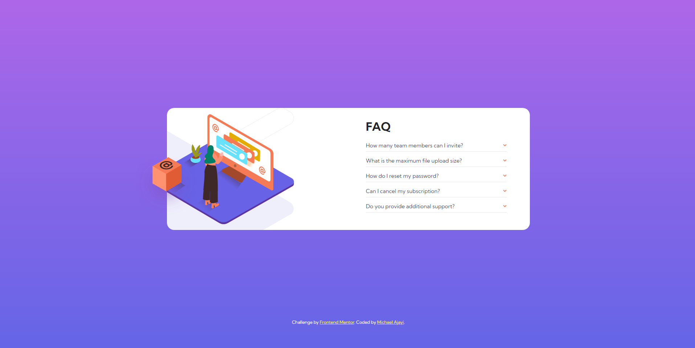

# Frontend Mentor - FAQ accordion card solution

This is a solution to the [FAQ accordion card challenge on Frontend Mentor](https://www.frontendmentor.io/challenges/faq-accordion-card-XlyjD0Oam). Frontend Mentor challenges help you improve your coding skills by building realistic projects. 

## Table of contents

- [Overview](#overview)
  - [The challenge](#the-challenge)
  - [Screenshot](#screenshot)
  - [Links](#links)
- [My process](#my-process)
  - [Built with](#built-with)
  - [What I learned](#what-i-learned)
- [Author](#author)
- [Acknowledgments](#acknowledgments)


## Overview

### The challenge

Users should be able to:

- View the optimal layout for the component depending on their device's screen size
- See hover states for all interactive elements on the page
- Hide/Show the answer to a question when the question is clicked

### Screenshot

A desktop view of how the site is...


### Links

- Solution URL: [https://www.frontendmentor.io/solutions/faq-accordion-card-YfARXsjZEK](https://www.frontendmentor.io/solutions/faq-accordion-card-YfARXsjZEK)
- Live Site URL: [https://faq-mentor-accordion.netlify.app/](https://faq-mentor-accordion.netlify.app/)

## My process

### Built with

- Semantic HTML5 markup
- CSS custom properties
- Flexbox
- Positioning
- CSS Grid
- Mobile-first workflow
- [Bootstrap](https://getbootstrap.com/) - CSS library

### What I learned

A trick about positioning that i learnt while doing this challenge is the fact that you can move another element based on changes done to a different element by just using flexbox and margins...

```html
<div class="container">
  <div class="box"></div>
  <p>Lot of text <a>Read more</a><p class="not-showing">Additional text</p></p>
```

```css
  .container {
    position: relative;
    display: flex;
    align-items: stretch;
  }

  .box {
    margin-top: 20%;
  }

  a.hover + p {
    /* do smt to add more text */
  }
```

The box would be displaced whenever the "anchor tag" is being hovered at;

## Author

- Website - [Michael Ajayi](https://michael-a.netlify.app)
- Frontend Mentor - [@michaelajayi150](https://www.frontendmentor.io/profile/michaelajayi150)
- Twitter - [@michaelajayi150](https://www.twitter.com/michaelajayi150)
- LinkedIn - [@ajayi-michael-692bb6203](https://www.linkedin.com/in/ajayi-michael-692bb6203/)

## Acknowledgments

I got inspired to take this challenge af6tering reading an article by [Riri](https://dev.to/riyanagueco) on [Dev.to](https://dev.to/). He talked about how this challenge was a little bit challenging for him so I decided to also give it a try

[DEV.TO article](https://dev.to/riyanagueco/i-did-frontend-mentor-challenges-for-three-weeks-here-s-what-i-learned-3j01)